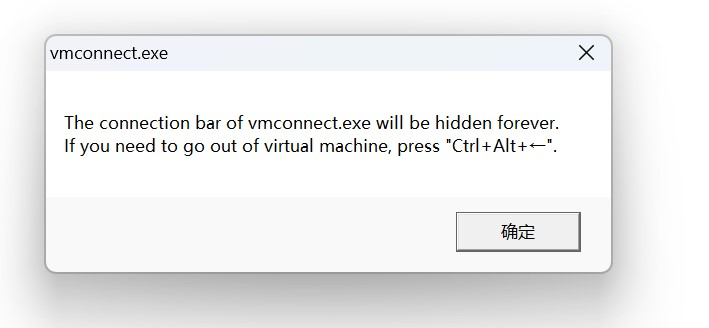

# FuckHypervConnectBar

> Hide annoying connect-bar at the top of of HyperV VM window when in full-screen mode

## Usage

1. Start and enter into any Hyperv VM
2. Execute `FuckHypervConnectBar.exe`
3. Wait until `[INFO] Success.`
4. Maximum the Window of Hyperv VM and unpin the connection bar. The connection bar will hide and never show again.

## Principle

- The launcher inject `ApiHooker.dll` into `vmconnect.exe`.
- `ApiHooker.dll` hook winapi `ShowWindow`. When it find that `ShowWindow` is called to show this connect-bar，just return TRUE without calling real `ShowWindow`.
- connect-bar's window name: `BBar`, window class name: `BBarWindowClass`

## Tips

